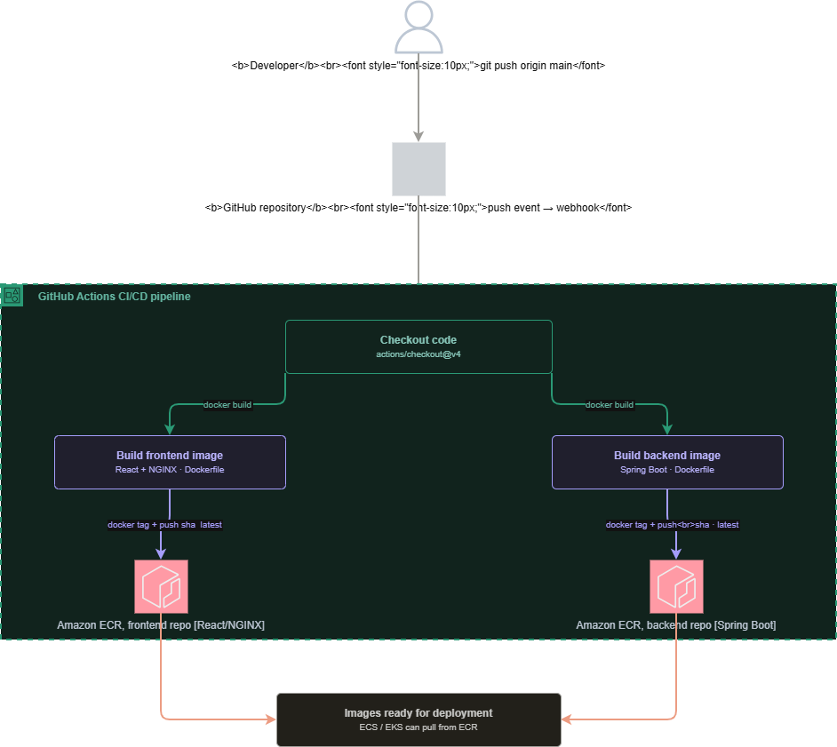

# 🚀 Employee Management Application – Full Stack + DevOps (AWS, Docker, ECS)

## 📌 Overview

This project is a **full-stack Employee Management Application** built with modern cloud and DevOps practices.

It demonstrates the **complete software lifecycle**:

```text
Development → Containerization → CI/CD → Cloud Deployment → Scaling
```

The project also showcases the **evolution from a traditional EC2-based deployment to a modern containerized architecture using Docker and AWS ECS**.

---

## 🏗️ Tech Stack

### 💻 Application

* **Frontend**: React (Vite)
* **Backend**: Spring Boot (Java 17)
* **Database**: MySQL (AWS RDS)

### ⚙️ DevOps & Cloud

* Docker (multi-container architecture)
* GitHub Actions (CI/CD)
* Amazon ECS (Fargate)
* Amazon ECR (container registry)
* AWS ALB (Load Balancer)
* Terraform (Infrastructure as Code)
* AWS EC2 (legacy deployment)

---

## 🧩 Architecture (Current – Containerized)


---

## 🔄 Deployment Evolution

This project demonstrates two deployment approaches:

---

### 🧱 1. Traditional Deployment (EC2 + JAR) – Legacy

* Backend packaged as JAR
* Uploaded to Amazon S3 via CI/CD
* EC2 instances (Auto Scaling Group) download and run JAR
* Managed using Terraform

> ⚠️ This approach is retained for comparison and learning purposes.

---

### 🐳 2. Modern Deployment (Docker + ECS) – Primary ✅

* Application containerized using Docker
* Separate images for frontend and backend
* Images pushed to Amazon ECR
* Deployed using Amazon ECS (Fargate)
* Traffic routed via Application Load Balancer

> ✅ This is the **recommended and actively used architecture**

---

## ⚙️ Application Features

* Add new employees
* View employee list
* REST API communication between frontend and backend
* Persistent storage using MySQL (RDS)

---

## 🐳 Containerization Strategy

### Frontend

* Built using React (Vite)
* Served via NGINX
* Port: `80`

### Backend

* Spring Boot application
* REST APIs
* Port: `8081`

---

## 🔀 Request Flow

```text
1. User opens application (via ALB)
2. Frontend loads from ECS (NGINX container)
3. Frontend calls /api endpoints
4. ALB routes /api/* → Backend service
5. Backend interacts with RDS database
6. Response returned to frontend
```

---

## 🔄 CI/CD Pipelines (GitHub Actions)

### 🐳 Container Pipeline (Primary)

1. Code pushed to GitHub
2. Docker images built:

   * frontend
   * backend
3. Images pushed to Amazon ECR
4. ECS services pull latest images and deploy

---

### 🧱 EC2 Pipeline (Legacy)

1. Frontend built and bundled into backend
2. Backend JAR created using Maven
3. JAR uploaded to Amazon S3
4. EC2 instances download and run application

---

## 📁 Project Structure

```text
employee-app/
│
├── frontend/
│   ├── src/
│   ├── nginx.conf
│   └── Dockerfile
│
├── backend/
│   ├── src/main/java
│   ├── src/main/resources
│   └── Dockerfile
│
├── .github/workflows/
│   ├── deploy-ecr.yml      # ECS deployment
│   └── deploy-s3.yml       # EC2 (legacy)
│
└── README.md
```

---

## 🔐 Configuration & Secrets

Application uses environment variables:

```text
DB_URL
DB_USERNAME
DB_PASSWORD
```

Configured via:

* ECS Task Definitions
* GitHub Secrets (CI/CD)

---

## 🧪 Running Locally

### Backend

```bash
cd backend
mvn spring-boot:run
```

### Frontend

```bash
cd frontend
npm install
npm run dev
```

---

### Docker (Optional)

```bash
docker build -t employee-frontend ./frontend
docker build -t employee-backend ./backend

docker run -p 80:80 employee-frontend
docker run -p 8081:8081 employee-backend
```

---

## 🌐 API Endpoints

### Get Employees

```text
GET /api/employees
```

### Create Employee

```text
POST /api/employees
```

---

## 🔐 Security Considerations

* RDS deployed in private subnets
* Backend not directly exposed to internet
* Access controlled via Security Groups
* Traffic routed only through ALB

---

## 📈 Key Highlights

* End-to-end full-stack application
* Containerized using Docker
* Deployed on AWS ECS (Fargate)
* CI/CD implemented using GitHub Actions
* Infrastructure managed using Terraform
* Demonstrates migration from EC2 → ECS

---

## 🔮 Future Enhancements

* Blue/Green deployments

---

## 👨‍💻 Author

Developed as part of a **Cloud & DevOps portfolio project** demonstrating:

* Full-stack development
* Containerization (Docker)
* CI/CD pipelines
* Cloud-native deployment (AWS ECS)

---

## ⭐ Final Note

This project reflects **real-world DevOps practices**, covering:

```text
Code → Build → Docker → ECR → ECS → ALB → User
```

It highlights both **foundational concepts (EC2)** and **modern cloud-native architecture (ECS)**.
